# GA1-220501093-04-AA1-EV04 – Fundamentos de Python: Clases, Objetos y Encapsulación

## Conceptos teóricos de Clase y Objeto – Primera parte

### Explicación de cada ejemplo

#### 1. Una clase vacía y creación de objetos

Se crea la clase `Coche` sin atributos ni métodos, solo con `pass`. Aunque esté vacía, ya podemos crear objetos de tipo `Coche`.

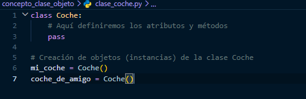

#### 2. El constructor `__init__` y `self`

La clase `Persona` tiene un método especial llamado `__init__`. Este método se ejecuta automáticamente cuando creamos una persona nueva. El parámetro `self` representa al objeto que se está creando; con `self.nombre = nombre` le estamos asignando el valor que recibimos al atributo `nombre` de ese objeto.

Creamos dos personas (`ana` y `juan`) y cada una guarda su propio nombre y edad. Al imprimirlos se comprueba que son independientes.

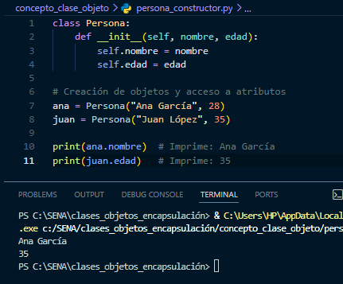

#### 3. Valores por defecto en el constructor
La clase `Producto` tiene un parámetro `stock` con valor por defecto `0`. Si al crear un producto no le decimos cuánto stock tiene, automáticamente se pone en cero. Si sí le damos un valor, se usa ese.

Esto sirve para que algunos datos sean opcionales y el objeto tenga siempre un valor razonable.

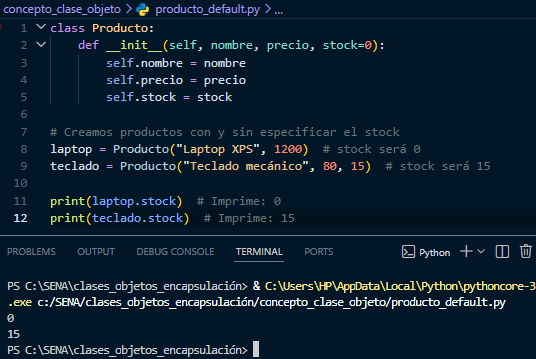

#### 4. Calcular atributos al crear el objeto

La clase `Rectangulo` recibe el ancho y el alto, y dentro del constructor calcula el área y el perímetro. Esos valores calculados se guardan en atributos normales (`self.area`, `self.perimetro`) y luego los usamos sin tener que volver a calcularlos.

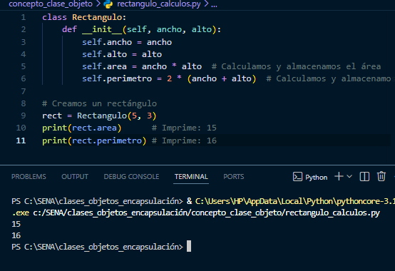

#### 5. Validar datos en el constructor

La clase `Cuenta` no permite que se cree una cuenta con saldo negativo. Si alguien lo intenta, lanza un error (`ValueError`). Esto evita que existan objetos en un estado incorrecto.

Primero creamos una cuenta válida y luego intentamos crear una inválida, capturando el error para que el programa no se Detenga.

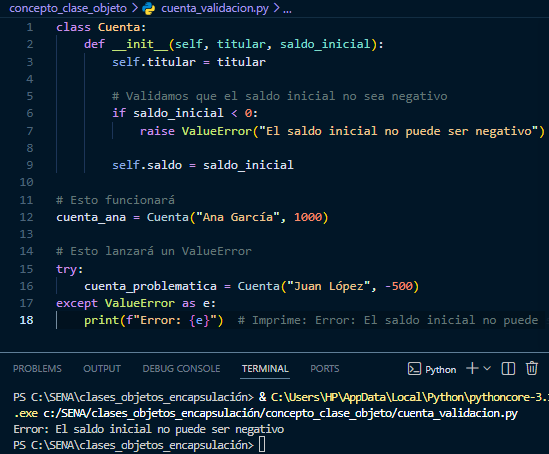

#### 6. Modelar un libro con varios atributos

La clase `Libro` guarda título, autor, páginas, ISBN y disponibilidad. El parámetro `disponible` es opcional (por defecto `True`). Al crear dos libros, uno se marca como prestado (`False`) y el otro queda disponible. Luego imprimimos su estado.

Este ejemplo muestra cómo una clase puede representar algo del mundo real agrupando toda la información importante.

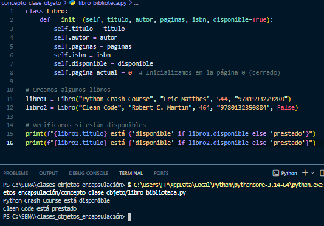

#### 7. Distintas formas de crear un objeto

La clase `Fecha` tiene el constructor normal, pero además dos métodos de clase que funcionan como fábricas de objetos:

- `desde_texto`: recibe una cadena "DD-MM-AAAA" y devuelve una `Fecha`.
- `hoy`: devuelve una `Fecha` con el día actual.

Esto permite crear objetos de manera más cómoda sin tocar el constructor original.

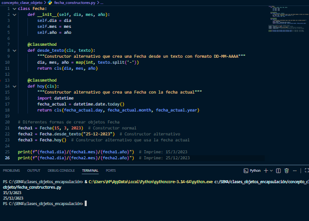

#### 8. Atributos de instancia

Cada objeto creado a partir de la clase `Estudiante` tiene sus propias copias de `nombre`, `edad` y `activo`. Si cambio los datos de un estudiante, el otro no se entera. Son independientes.

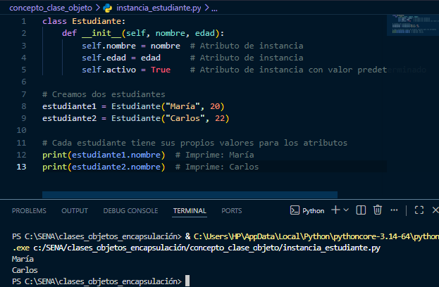

#### 9. Atributos de clase

El atributo `universidad` está definido en la clase, no en cada objeto. Todos los estudiantes comparten la misma universidad. Si cambio `Estudiante.universidad`, el cambio se refleja en todas las instancias.

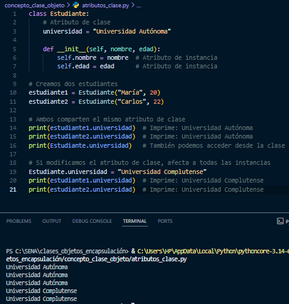

#### 10. Acceder a los atributos

Usamos la notación `objeto.atributo` para leer tanto atributos de instancia como de clase. También podemos leer el atributo de clase directamente desde la clase misma (`Producto.impuesto`).

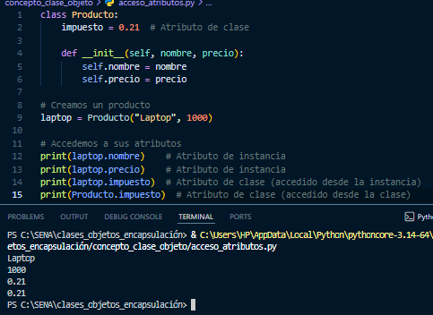

#### 11. Modificar atributos

Después de crear un objeto podemos cambiar sus atributos asignándoles un nuevo valor. Aquí pintamos un coche de rojo y le ponemos kilometraje 1500.

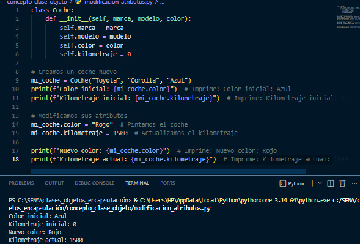

#### 12. Atributos dinámicos
Python permite agregar atributos a un objeto "sobre la marcha". A `juan`, que originalmente solo tenía `nombre`, le añadimos `edad` y `profesion`. Es flexible, pero hay que tener cuidado de no olvidar inicializar los atributos importantes en el constructor.

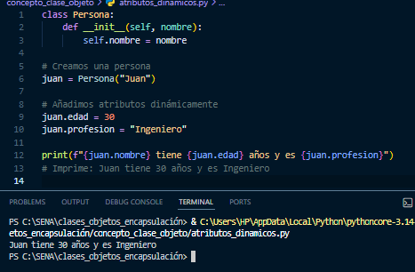

#### 13. Atributos privados y protegidos

Por convención, un guion bajo (`_saldo`) indica que el atributo es "protegido" y no debería tocarse desde fuera. Dos guiones bajos (`__pin`) activan un mecanismo que cambia el nombre del atributo para que sea más difícil acceder a él por error. Aun así, Python no bloquea el acceso de forma absoluta.

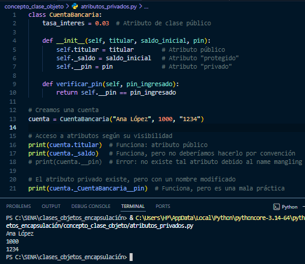

#### 14. Propiedades

Con los decoradores `@property` y `@nombre.setter` podemos hacer que al leer o escribir un atributo se ejecute código. La clase `Temperatura` permite usar `celsius` y `fahrenheit` como si fueran atributos normales, pero con validación y conversión automática.

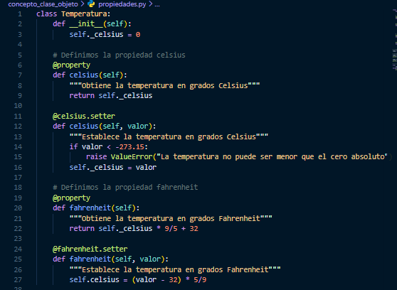
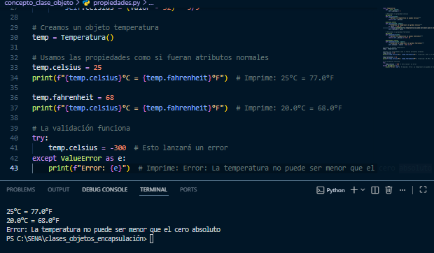

#### 15. Atributos calculados

En lugar de guardar el área y el perímetro, los calculamos cada vez que los pedimos usando `@property`. Así, si cambiamos el ancho, el área y el perímetro se actualizan solos.

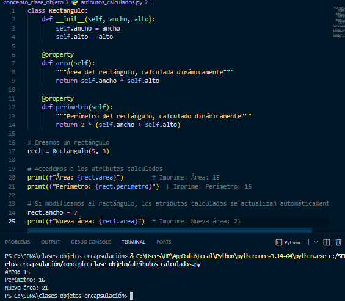

#### 16. Atributos especiales

Python guarda información interna en atributos como `__class__` (la clase del objeto), `__name__` (nombre de la clase), `__doc__` (su documentación) y `__dict__` (los atributos de instancia). Podemos leerlos para inspeccionar objetos.

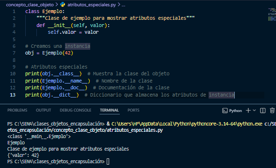

#### 17. Funciones para manejar atributos

Las funciones `hasattr`, `getattr`, `setattr` y `delattr` permiten trabajar con atributos de manera dinámica. Útiles cuando no sabemos el nombre del atributo de antemano. Aquí vemos cómo comprobar si existe un atributo, leerlo, crearlo y eliminarlo.

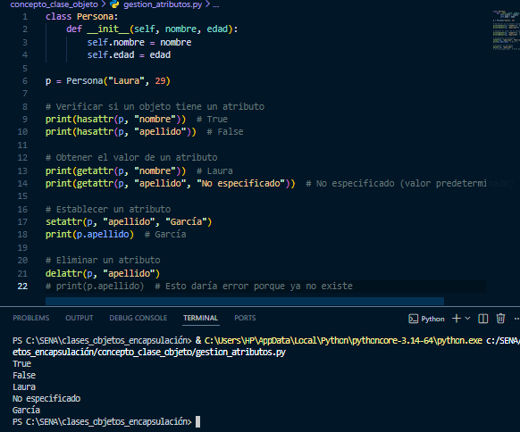

#### 18. Definir métodos

La clase `Coche` tiene dos métodos, `encender` y `apagar`. Ambos llevan `self` como primer parámetro, lo que les permite acceder a los atributos del coche (`self.encendido`, `self.velocidad`). Aquí solo se define la clase; el uso está en el siguiente ejemplo.

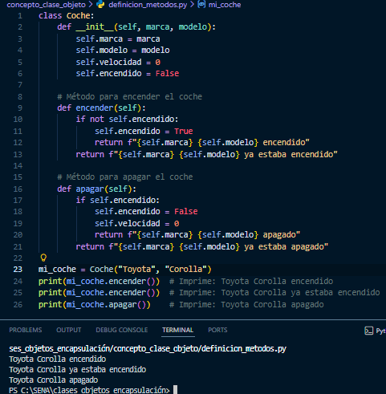

#### 19. Métodos con parámetros

Los métodos `acelerar` e `frenar` reciben un número (cuánto acelerar o frenar). Validan que el coche esté encendido y que no se supere la velocidad máxima. Siempre devuelven un mensaje con el resultado.

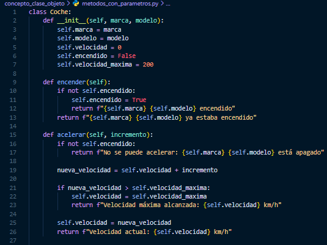
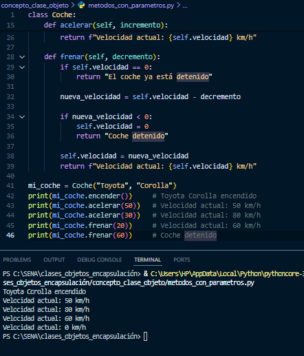

#### 20. Métodos que modifican atributos

La clase `CuentaBancaria` tiene métodos para consultar saldo, depositar y retirar. Todos leen o modifican `_saldo`, aplicando reglas: no se puede depositar o retirar cantidades negativas y no se puede gastar más de lo que hay.

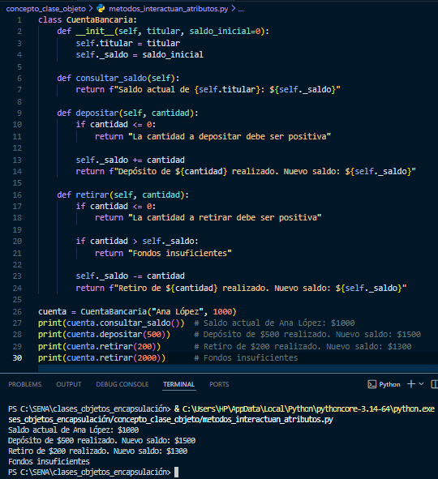

#### 21. Métodos que devuelven valores complejos 

La `Calculadora` puede devolver números, mensajes de error y hasta diccionarios con estadísticas. Así el objeto puede entregar información procesada sin necesidad de tratar los datos fuera de la clase.

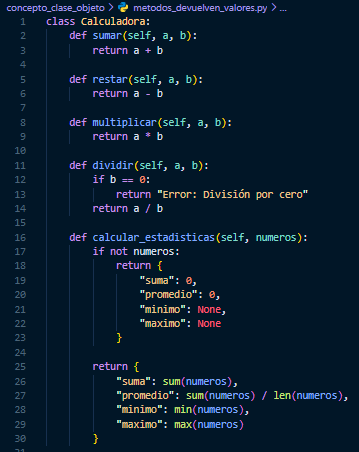
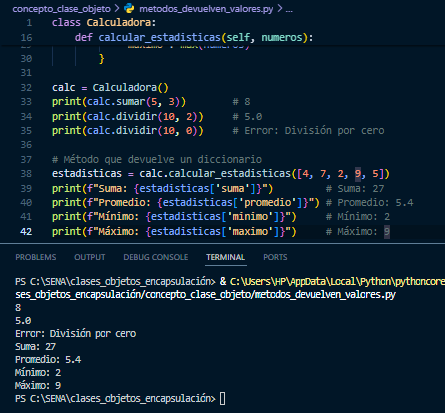

#### 22. Métodos que se llaman entre sí

El método `presentarse` de `Persona` invoca a `nombre_completo` y a `es_mayor_de_edad` con `self`. De esta forma, el código se reutiliza y la lógica queda ordenada.

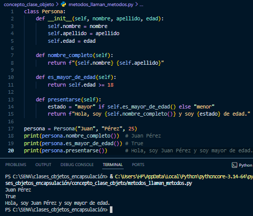

#### 23. Métodos especiales o “dunder”

La clase `Punto` define `__str__` (para mostrarse bonito), `__repr__` (para desarrolladores), `__add__` (para sumar dos puntos con `+`), `__eq__` (para comparar con `==`) y `__len__` (para usar `len()`). Estos métodos hacen que nuestros objetos se comporten como los tipos nativos de Python.

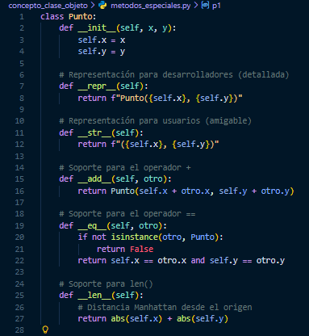
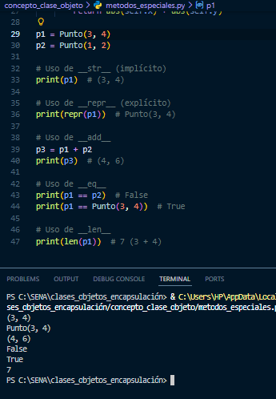

#### 24. Métodos estáticos
Los métodos de `MathUtils` llevan `@staticmethod` y no reciben `self`. Son funciones independientes que agrupamos dentro de la clase porque tienen relación lógica. Se llaman directamente desde la clase sin crear una instancia.

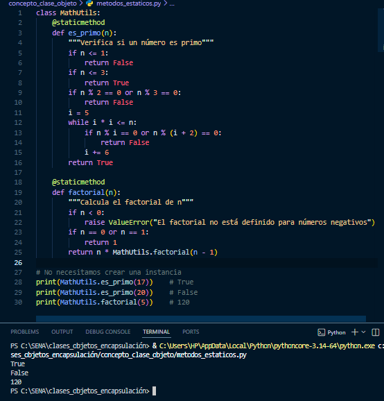

#### 25. Métodos de clase 

Los métodos de `Empleado` llevan `@classmethod` y reciben `cls` (la clase) en lugar de `self`. `desde_salario_anual` actúa como un constructor alternativo, y `obtener_num_empleados` sirve para consultar cuántos empleados se han creado.

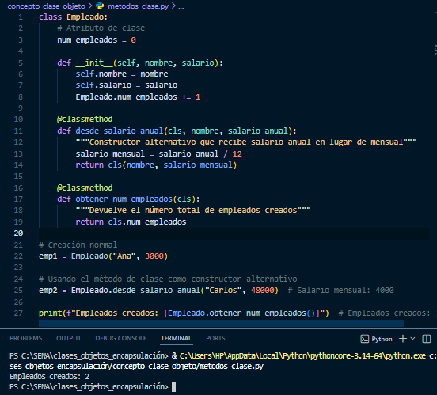

#### 26. Ejemplo integrador: la biblioteca 

La clase `Libro` junta todo lo aprendido: constructor, métodos que validan el estado (`abrir`, `cerrar`, `leer`), cálculos de avance de lectura y un método especial `__str__`. La simulación muestra cómo el libro pasa de cerrado a leerse por completo y luego se reinicia.

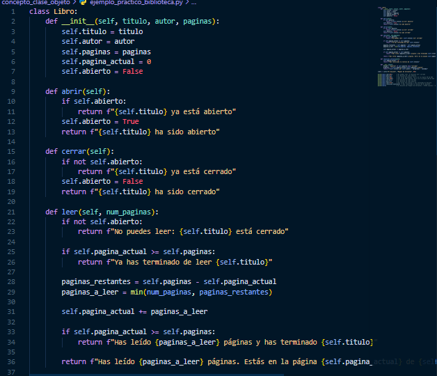
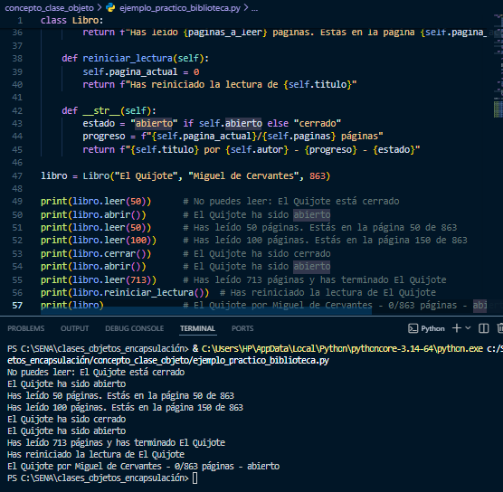

## Encapsulación en Python

### Explicación de cada ejemplo

#### 1. Atributos privados por convención

En Python, ponemos un guion bajo antes del nombre (`_saldo`) para avisar que ese atributo es interno y no debería tocarse desde fuera. Aún así, el lenguaje lo permite.

Aquí creamos una cuenta de banco y vemos que podemos leer el saldo directamente, aunque no es buena idea.

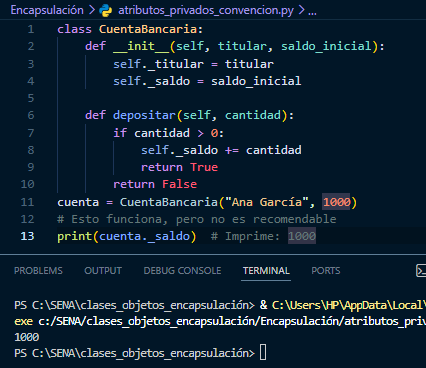

#### 2. Atributos con doble guion bajo

Cuando usamos dos guiones bajos (`__pin`), Python cambia el nombre interno para que sea más difícil acceder por accidente. El atributo solo se puede usar desde dentro de la clase mediante métodos.

En el ejemplo intentamos leer `cuenta.__pin` y falla, pero se puede acceder si se conoce el truco (`_CuentaBancaria__pin`), aunque eso está mal visto.

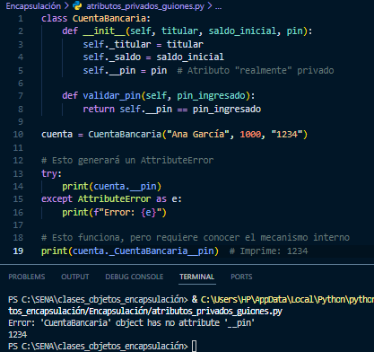

#### 3. Validación en el constructor

El material muestra la clase `Producto`, que valida que el precio no sea negativo. En el código original solo aparece la definición de la clase; no incluye una ejecución de prueba.

Para poder observar cómo funciona la validación, al final del archivo agregamos una pequeña demostración: intentamos crear un producto con precio negativo y capturamos el error que se genera.

La clase permanece exactamente igual a la del documento, y la prueba adicional nos permite comprobar que el `ValueError` se lanza correctamente.

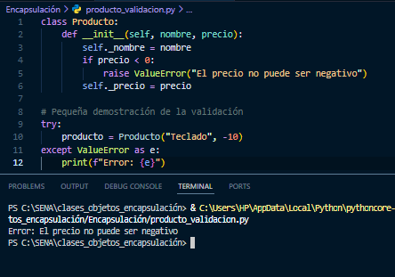

#### 4. Atributos protegidos vs. privados en herencia

Los atributos con un guion bajo (`_marca`) pueden usarse en clases hijas. Los que tienen dos guiones bajos (`__modelo`) no son visibles desde la clase hija.

La clase `Coche` intenta mostrar el modelo y falla, mientras que la marca sí la puede usar.

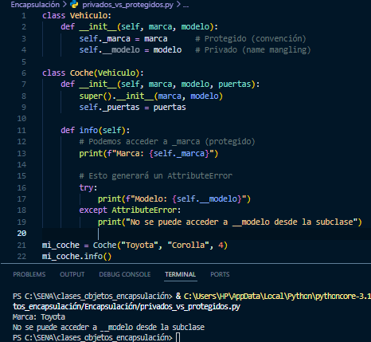

#### 5. Getters y setters

Para acceder a atributos privados de forma controlada, creamos métodos como `get_nombre()` y `set_nombre()`. Así podemos validar los valores antes de guardarlos.

En la prueba vemos que se puede cambiar el nombre y la edad, pero si intentamos poner una edad negativa se produce un error.

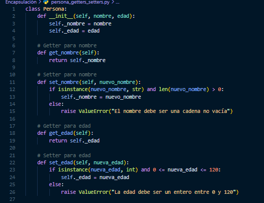
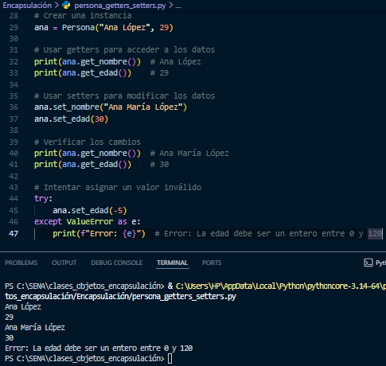

#### 6. Producto con getters y setters

La clase `Producto` tiene métodos para obtener y modificar nombre, precio, stock y descuento. Al pedir el precio se aplica el descuento automáticamente.

Probamos a crear un portátil, aplicar un 15% de descuento, vender una unidad, y tratar de poner un precio negativo.

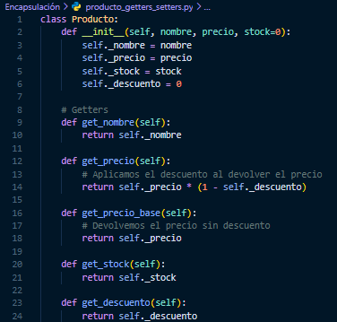
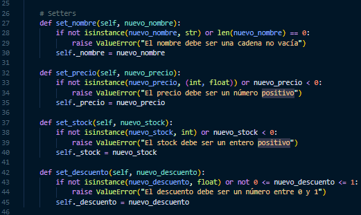
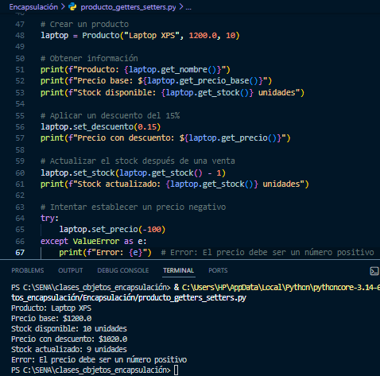

#### 7. Herencia y setters

Aquí vemos cómo una clase hija (`Electrónico`) hereda todo lo bueno de `Producto` y además le agrega sus propias reglas.  
`Electrónico` tiene un atributo nuevo (`_garantía_meses`) y modifica el método `set_precio` de la clase padre: cuando el nuevo precio supera los 1000, la garantía se alarga automáticamente a 24 meses (si era menor).

Al ejecutar el archivo se crea un televisor con precio 1500 y garantía de 12 meses. Luego se le sube el precio a 2000 y, como es mayor que 1000, la garantía sube sola a 24 meses. Así se prueba que la lógica adicional funciona sin tocar la clase original.

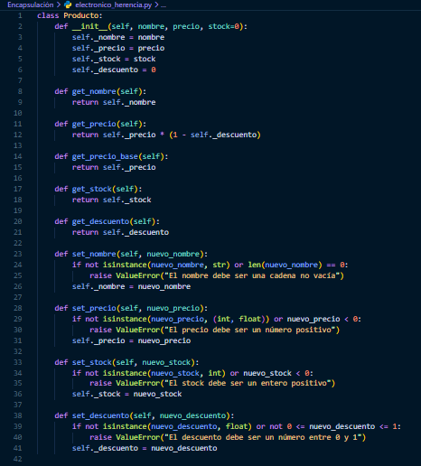
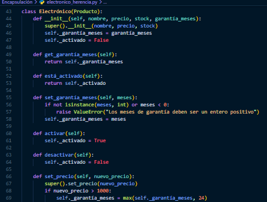
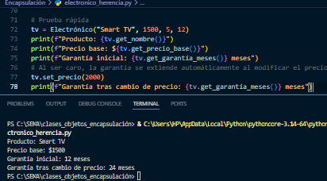

#### 8. Temperatura con propiedades
Con `@property` y `@celsius.setter` accedemos a la temperatura en grados Celsius o Fahrenheit como si fueran simples variables. Si intentamos poner una temperatura imposible, salta un error.

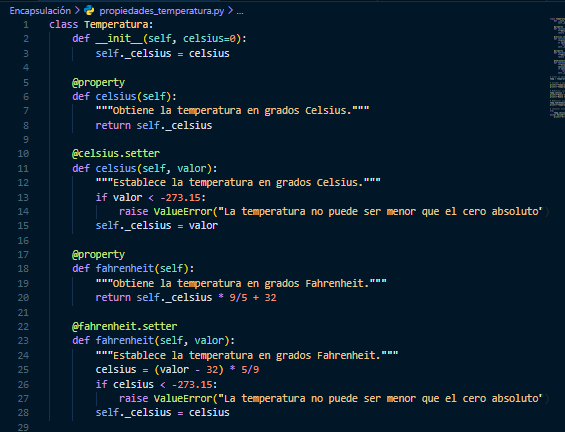
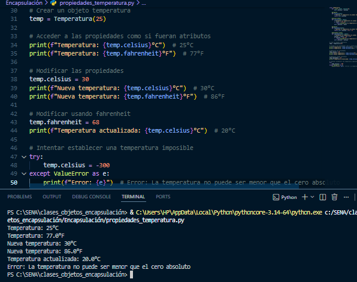

#### 9. Propiedad con deleter

Además de getter y setter, podemos definir un `@amigos.deleter` que se ejecuta al usar `del`. En este ejemplo, al devolver la lista de amigos entregamos una copia para que no se modifique la original sin control. Al hacer `del`, se vacía la lista.

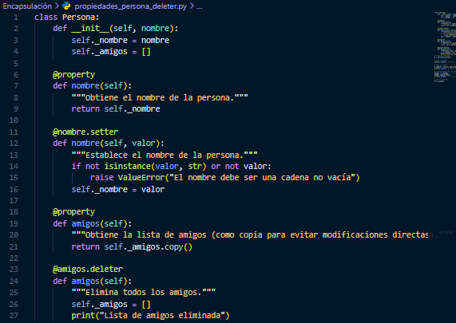
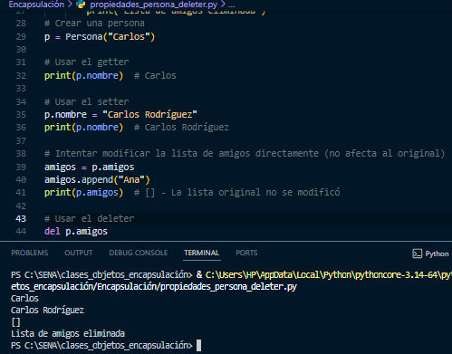

#### 10. Propiedades de solo lectura

El área y el perímetro de un círculo se calculan a partir del radio, pero no tienen sentido si alguien las escribe directamente. Al omitir el setter, esas propiedades quedan de solo lectura.

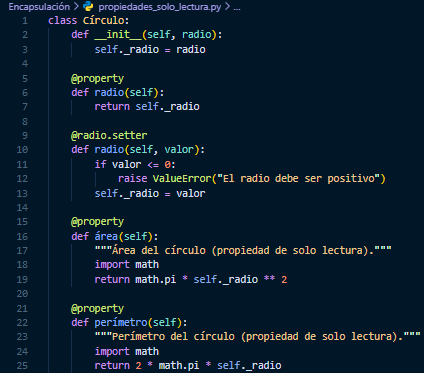
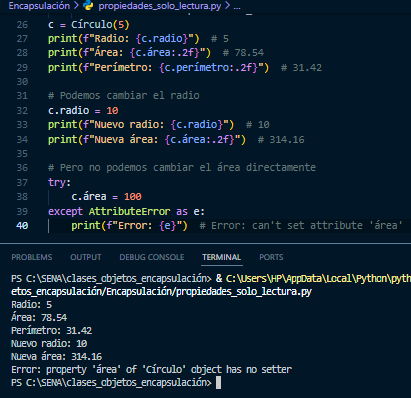

#### 11. Propiedades calculadas

El salario total se calcula automáticamente con la fórmula base + horas extra × tarifa. Si cambiamos las horas o la tarifa, el salario total se actualiza solo.

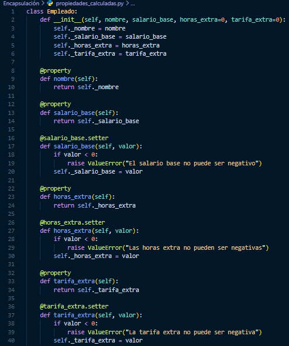
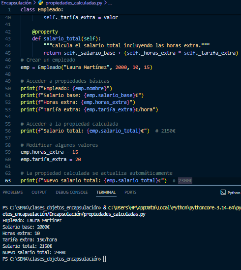

#### 12. De getters a propiedades

Se muestra cómo empezar con atributos públicos, luego meter getters/setters clásicos y finalmente pasarse a propiedades. La versión final (`ProductoV3`) se usa igual que la primera (`ProductoV1`), pero con validación incluida.

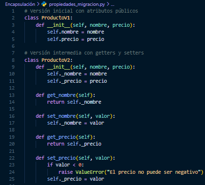
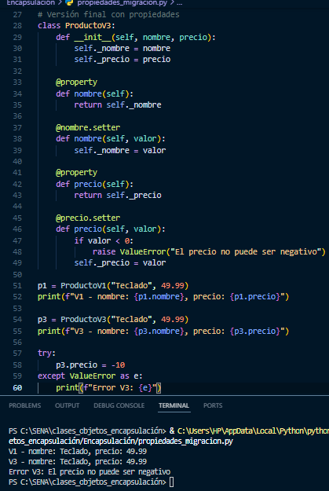

#### 13. Propiedades en herencia

La clase `ProductoDigital` hereda de `Producto` y añade la propiedad `tamaño_mb`. Además sobrescribe `info` para mostrar el tamaño. Al modificar el precio o el tamaño, la propiedad `info` se adapta.

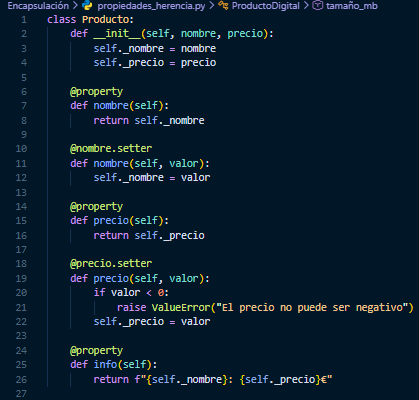
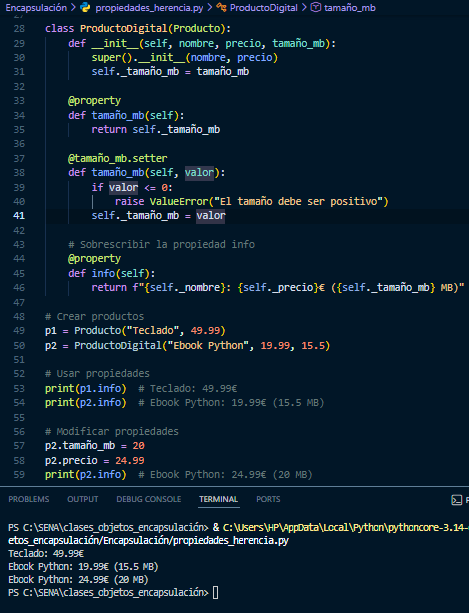

#### 14. Método privado `__generar_hash` 

La clase `Autenticador` guarda la contraseña como un código cifrado (hash). Para hacer ese cálculo usa el método privado `__generar_hash`. Luego, el método público `verificar_contraseña` vuelve a usar ese mismo método para comparar.

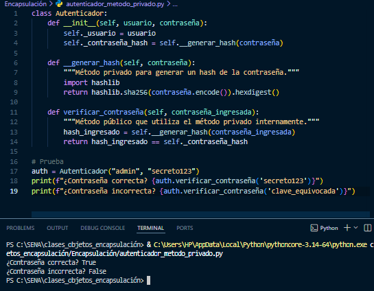

#### 15. Varios métodos privados trabajando juntos

`ProcesadorTexto` limpia y analiza un archivo de texto. Los pasos (leer, normalizar, calcular estadísticas) están en métodos privados. El único método público coordina el trabajo y luego otros públicos entregan los resultados.

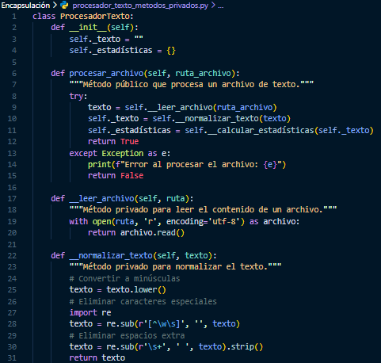
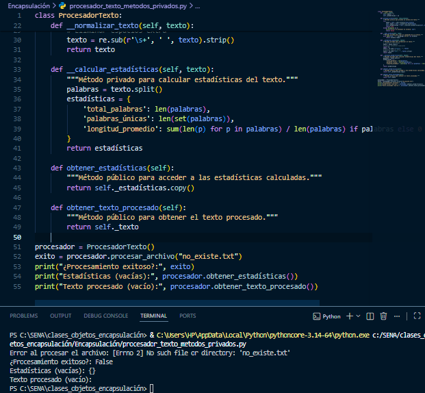

#### 16. Métodos privados vs. funciones auxiliares

Si la ayuda solo sirve dentro de un método, puede ser una función interna. Si la necesitan varios métodos de la clase, mejor un método privado. El ejemplo muestra dos formas equivalentes de duplicar números.

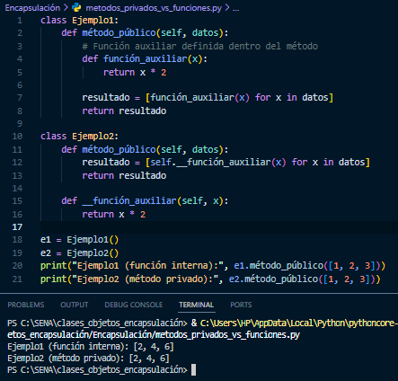

#### 17. Métodos privados en herencia

Los métodos con `__` no se pueden llamar directamente desde una clase hija. La clase `Derivada` intenta usar `__método_privado` y falla. Sin embargo, el método heredado de `Base` sí puede acceder al suyo.

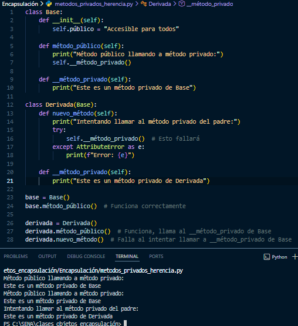

#### 18. Métodos protegidos en herencia

Usando un solo guion bajo (`_obtener_área`) indicamos que es un método pensado para que las subclases lo sobrescriban. `Círculo` y `Rectángulo` heredan de `Forma` y cada uno calcula su área a su manera.

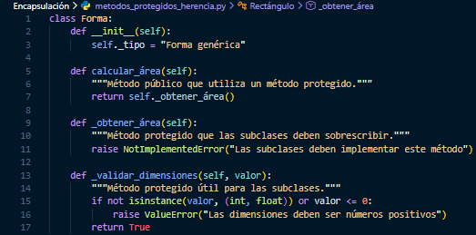
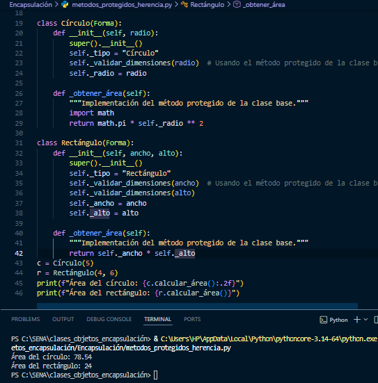

#### 19. Validación compleja con métodos privados 

La clase `Formulario` recibe datos (nombre, email, contraseña, edad) y los revisa automáticamente. El método `validar` coordina todo, pero el trabajo real lo hacen cuatro métodos privados:

- **Campos requeridos**: verifica que los datos importantes no estén vacíos.
- **Email**: comprueba que tenga formato de correo (con @ y punto).
- **Contraseña**: exige mínimo 8 caracteres, una mayúscula y un número.
- **Edad**: valida que sea un número entre 18 y 120.

Cada método guarda sus errores y luego `obtener_errores` los entrega. Así, quien usa la clase solo llama a `validar` y no se mete en cómo se hacen las comprobaciones. Si una regla cambia, se modifica un solo método sin tocar el resto.

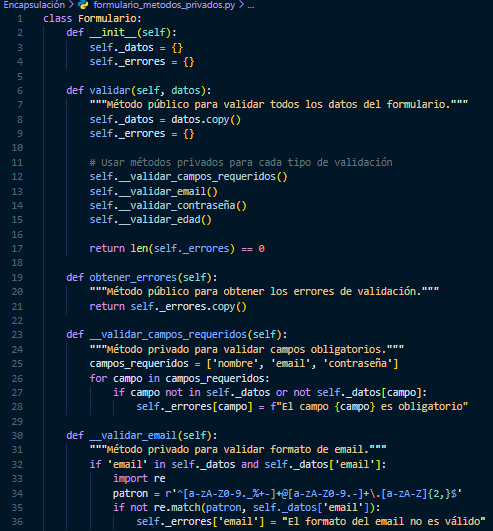
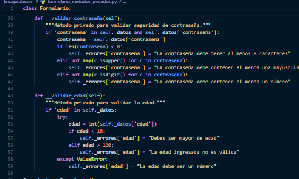
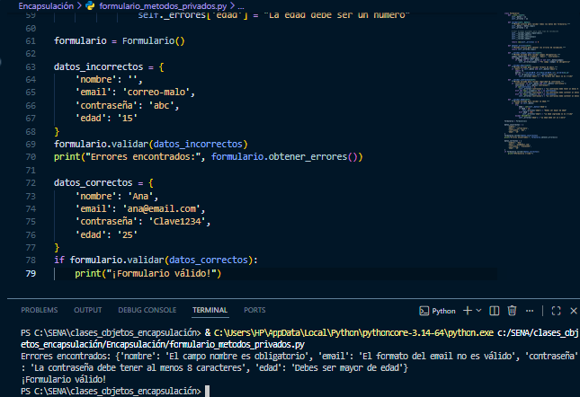